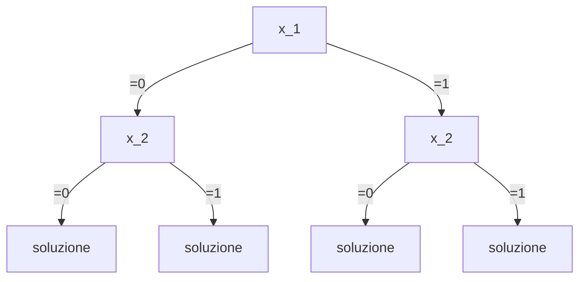

#uni 
Costruisco un albero cui ad ogni stadio fisso una variabile

```mermaid
graph TD

    x_1 --=0--> C1[x_2]
    x_1 --=1--> C2[x_2]
    
    C1 --=0--> D1[soluzione]
    C1 --=1--> D2[soluzione]
    
    C2 --=0--> D3[soluzione]
    C2 --=1--> D4[soluzione]
```
E quindi $P_{ij}$ è un problema dove ho fissato per prime $i$ variabili.
In un albero ci sono $2^n$ archi e $n$ stadi di rami.