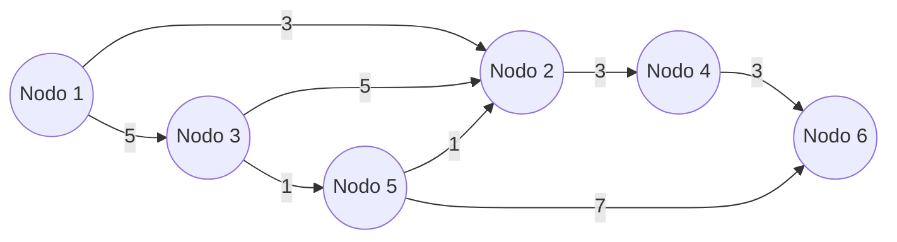

#uni 
Questo è un problema di programmazione lineare reale/intero.
Su questa famiglia di problemi vale il [[Teorema di Interezza]], e poiché il [[Problema di Trasporto]] ne è sottoinsieme vale anche su questa classe.
Vale il [[Teorema Astratto di Equivalenza tra PL e PLI]].
Si risolve con il simplesso duale, ma per sua natura possiamo semplificare molto l'algoritmo, applicandone una versione particolare apposita: [[Algoritmo del Simplesso su Reti]]. 
Si fa utilizzo dei Nodi. 
- $|N|=n$ 
- $|A|=m$, $A \subset N\times N$ ovvero è un sottoinsieme di tutte le possibili connessioni

# Flusso su Reti
Alcuni Nodi sono detti ___Sorgenti___ e producono il bene, altri si chiamano ___Pozzi___ e richiedono il bene.
I sorgenti vengono indicati con il segno meno, i pozzi vengono indicati con il segno più.
### Vincoli
indichiamo con $x_{ij}$ l'unità flusso sull'arco dal nodo $i$ al nodo $j$.
$X=(x_{12}\quad x_{13} \quad ..)$ 
___Equazioni di Bilancio ai Nodi___:
per ogni nodo sommo entrate (uscite con meno) e controllo che la somma faccia il _bilancio_ richiesto dal nodo. 
### Funzione obiettivo
Ogni arco ha un costo, che va moltiplicato per il flusso sul nodo, ovvero ogni unità in flusso su quel nodo "paga" il costo su quel nodo.
La funzione obiettivo quindi è minimizzare la somma dei prodotti tra i flussi e i costi.
# Matrice di Incidenza della Rete 
Si usa per sostituire un disegno della rete.
Ha tante righe quanti sono i nodi.
Ha tante colonne quanti sono gli archi.
Per ogni casella:
- se il nodo è sorgente dell'arco, si mette $-1$ 
- se il nodo è destinazione dell'arco, si mette $1$ 
- se il nodo non ha a che fare con l'arco, si mette $0$ 
Ovvero per l'arco $a_{ij}$, su $i$ si mette $-1$, su $j$ si mette $1$, sugli altri si mette $0$.
Su ogni colonna ci sono esattamente UN $-1$ ed UN $1$.
# Considerazioni sul Rango della Matrice di Incidenza 
Le basi sono di dimensione $n\times n$ 
**ATTENZIONE**: se sommi le righe della matrice di incidenza della rete, fa $0$, quindi il rango non è $n$, quindi non ci sono sottomatrici $n\times n$ invertibili, quindi non trovo le basi, quindi niente simplesso e niente linprog.
Prendiamo un albero di Copertura della rete, quindi su $n$ nodi, sono $n-1$ archi ([[Algoritmo di Kruskal]]). Ricordiamo che le foglie sono i nodi di grado $1$ (con un arco).
Si parte da un nodo foglia, si prende un suo arco, si mette nella matrice e si cancella arco e nodo padre. Ottengo una sottomatrice della [[#Matrice di Incidenza della Rete]] di dimensione $n-1\times n-1$.
In particolare ottengo una matrice triangolare inferiore con $-1$ e $1$ sulla diagonale.

|     | 54  | 32  | 24  | 12  |
| --- | --- | --- | --- | --- |
| 5   | -1  | 0   | 0   | 0   |
| 3   | 0   | -1  | 0   | 0   |
| 4   | 1   | 0   | 1   | 0   |
| 2   | 0   | 1   | 1   | 1   |
### Teorema della Caratterizzazione delle Basi
Il rango della [[#Matrice di Incidenza della Rete]] è pari a $n-1$, e le matrici degli alberi di copertura, chiamate $E_T$, hanno $det \neq 0$, e viceversa, quindi le Basi sono alberi di copertura.
Quindi dalla Matrice di Incidenza tolgo una riga a caso, che tanto è sovrabbondante.
# Modello
La matrice $E$ è la [[#Matrice di Incidenza della Rete]] meno una riga a caso, di solito la prima.
Quindi ha dimensione $n-1 \times m$ 
Con $T$ indico Base, con $L$ indico non di Base (sta per _lower bound_ del flusso).
È in [[Problema di Programmazione Lineare (PL)#Formato Duale Standard]].
$$\begin{cases} min \quad c^Tx \\ E \ x=b \\ x \geq 0\end{cases}$$
# Tecnica per Costruzione di Soluzione associata a Base
Prendo una Base, ovvero un albero di copertura (prendo $n-1$ archi)
Pongo a $0$ le variabili non di base $x_L$.
Adesso devo risolvere $E_T \cdot x_T=b$
Prendiamo una foglia e mettiamo il suo arco al bilancio richiesto del nodo.
Ripeto con un'altra foglia, tenendo conto del flusso già occupato.
Ripeto fino a terminare le foglie ed ottengo $\overline x=(...)$, essendo in Duale il problema, questa soluzione è ammissibile se tutte le sue componenti sono $\geq 0$.
QUINDI su $n$ nodi per soddisfare la rete bastano $n-1$ archi, per il [[#Teorema]].
Una soluzione, come in ogni duale std, è degenere se nelle componenti di base c'è uno zero.
# Controllo dell'Ottimo
Per il controllo dell'ottimo utilizziamo sempre il [[Teoria della Dualità#Test dell'Ottimalità]].
Ipotizziamo di avere una soluzione di base ammissibile:
Il problema di partenza è in formato Duale Standard quindi dobbiamo trovare la soluzione $\pi$ del primale associato: $\begin{cases} max\quad b^Tπ \\ E^Tπ\leq c\end{cases}$ , questa soluzione prende il nome di ___potenziale___, e si calcola come segue:
1. pongo un nodo a _potenziale_ $zero$, di norma il primo
2. Il potenziale del nodo $j$: $π_j= π_i + c_{ij}$ partendo da $i = 1$.
Essendo la nostra una soluzione di base ammissibile, se anche il potenziale è ammissibile siamo all'ottimo, il potenziale è ammissibile se non viola le ___condizioni di Bellman___ ([[Teorema di Bellman]]).
# Controllare se una Soluzione è Soluzione di Base
Per controllare se una soluzione è di base, deve avere almeno $m-(n-1)$ zeri, con $m$ archi e $n$ nodi, ovvero devono essere a $zero$ almeno i flussi sugli archi $\in L$, non di base. Poi se qualche flusso $\in T$, di base è $zero$, la soluzione è degenere.
# Considerazioni sul Modello Multiobiettivo
Se cerchiamo di risolvere un problema con più di un obiettivo, potendo noi risolvere solo problemi con un obiettivo, trasformiamo tutti gli obiettivi meno che uno in vincoli, e li aggiungiamo al modello.
Esempio con due obiettivi:
$$\begin{cases} min \quad c^Tx \\ E\cdot x=b \\ c^T\cdot x\leq C \\ x \geq 0 \end{cases}$$
questa aggiunta di vincoli però rende la matrice $E$ non più una [[#Matrice di Incidenza della Rete]] e quindi perdiamo la validità del [[Teorema di Interezza]].