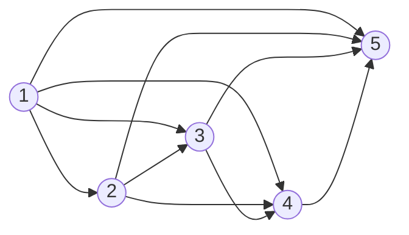
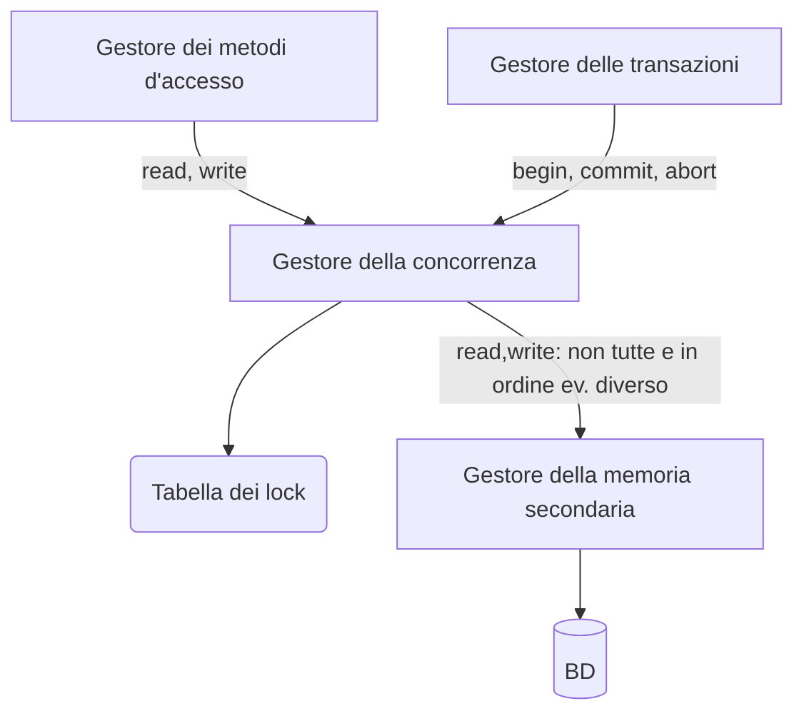
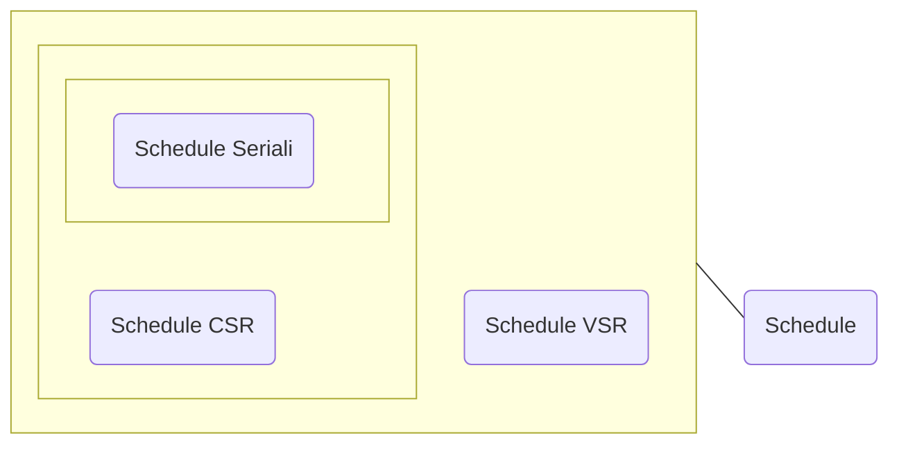

#uni 
La concorrenza è fondamentale, decine o centinaia di transazioni al secondo non possono essere seriali. Si appoggia sulla [[Gestione delle Transazioni]].
Senza una gestione accurata la concorrenza causerebbe però anomalie: per esempio se due transazioni operano sullo stesso valore possono leggere un valore intermedio "sporco".
Ci sono diversi tipi di anomalie:
- perdita di aggiornamento: W-W
- Lettura sporca: R-W o W-W con aborto
- Lettura inconsistente: R-W
- Aggiornamento Fantasma: R-W
- Inserimento fantasma: R-W su dato "nuovo"
# Schedule
Uno schedule $S$ è una sequenza di operazioni di lettura/ scrittura di transazioni concorrenti.
Esempio: $S:r_1(x) \ \ r_2(z) \ \ w_1(x) \ \ w_2(z)$ dove $r_2(x)$ rappresenta la lettura dell'oggetto $x$ da parte della transazione $T_1$.
Le operazioni compaiono nello schedule nell'ordine temporale di esecuzione sul database.
### Schedule seriale
Uno schedule di transazioni $T=\{T_1,...,T_n\}$ è detto seriale se per ogni coppia di transazioni tutte le operazioni di una delle due sono eseguite prima di qualsiasi operazione dell'altra.
Esempio: $T=\{T_0,T_1\} \to S = r_0(x) \ \ r_0(y) \ \ r_1(x) \ \ w_1(y)$  
### Schedule Serializzabile
Questo è un insieme di transazioni che produce lo stesso risultato di uno schedule seriale sulle stesse transazioni. Questa definizione richiede però un concetto di equivalenza fra schedule.
### View-Serializzabilità
Diciamo che esiste una relazione ___legge-da___ tra le operazioni $r_i(x)$ e $w_j(x)$ presenti in uno schedule $S$ se $w$ precede $r$ e se tra le due non ci sono altre $w$. La scrittura $w_j(x)$ in $S$ è detta ___scrittura finale___ su $x$ se è l'ultima $w$ su $x$ in $S$.
Due schedule $S_i$ e $S_j$ sono detti ___view-equivalenti___, $S_i \approx_v S_j$ se hanno la stessa relazione __legge-da__ e le stesse __scritture finali__ su __ogni oggetto__.
Uno schedule $S$ è ___view-serializzabile___ se è __view-equivalente__ ad un qualche schedule seriale.
L'insieme degli schedule view-serializzabili è indicato con ___VSR___.
La verifica della _view-equivalenza_ di due dati schedule ha complessità polinomiale.
La verifica sulla _view-serializzabilità_ di uno schedule è un problema NP-completo poiché è necessario confrontare lo schedule con tutti i possibili schedule seriali, questo lo rende inutilizzabile nella pratica.
Poiché l'uso della view-serializzabilità nella pratiac è impossibile definiamo una condizione di equivalenza più ristretta ma che sia utilizzabile nella pratica, quindi che abbia una complessità inferiore.
### Conflict-Serializzabilità
Un'operazione $a_i$ è ___in conflitto___ con un'altra operazione $a_j$ se operano sullo stesso oggetto e almeno una di esse è una scrittura. Nota bene: nei conflitti conta l'ordine.
Il conflitto può essere:
- R-W oppure W-R
- W-W
Due schedule $S_i$ e $S_j$ sono detti ___conflict-equivalenti___, $S_i \approx_c S_j$ se hanno le stesse operazioni e ogni coppia di operazioni in conflitto compare nello stesso ordine in entrambi.
Uno schedule $S$ è ___conflict-serializzabile___ se è _conflict-equivalente_ ad un qualche schedule seriale.
L'insieme degli schedule _conflict-serializzabili_ è indicato con ___CSR___.
### Teorema
ogni schedule _conflict-serializzabile_ è _view-serializzabile_, ma non necessariamente viceversa, quindi $CSR \implies VSR$ poiché $\approx_c \implies \approx_v$.
### Verifica della _Conflict-Serializzabilità_
Si fa tramite il ___grafo dei conflitti___ ([[Grafo]]):
- Un __nodo__ per ogni __transazione__ $T_i$ 
- un __arco__ (orientato) da $T_i$ a $T_j$ se c'è almeno un __conflitto__ fra un'azione $a_i$ e un'azione $a_j$ tale che $a_i$ __precede__ $a_j$ 
__Teorema__: Uno schedule è in __CSR__ se e solo se ___il grafo è aciclico___.
	Esempio:
	-  S = $w_1(x) w_2(x) r_3(x) r_1(y) w_2(y) r_1(z) w_3(z) r_4(z) w_4(y) w_5(y)$
	-  $x : w_1 \, w_2 \, r_3$
	-  $y : r_1 \, w_2 \, w_4 \, w_5$
	-  $z : r_1 \, w_3 \, r_4$
	- Il grafo è aciclico $\to$ $S$ è **CSR**, quindi anche **VSR** 

# Controllo di Concorrenza
Il controllo della concorrenza è eseguito dallo ___scheduler___, che traccia tutte le operazioni eseguite sul database dalle transazioni e decide se accettare o rifiutare le operazioni che vengono richieste, il suo obiettivo è evitare le __anomalie__.
Per il momento assumiamo che l'esito delle transazioni sia noto a priori (ipotesi ___commit-proiezione___), così facendo possiamo rimuovere dallo schedule tutte le transazioni abortite, questa assunzione però non ci consente di trattare anomalie come la lettura sporca.
# Media

