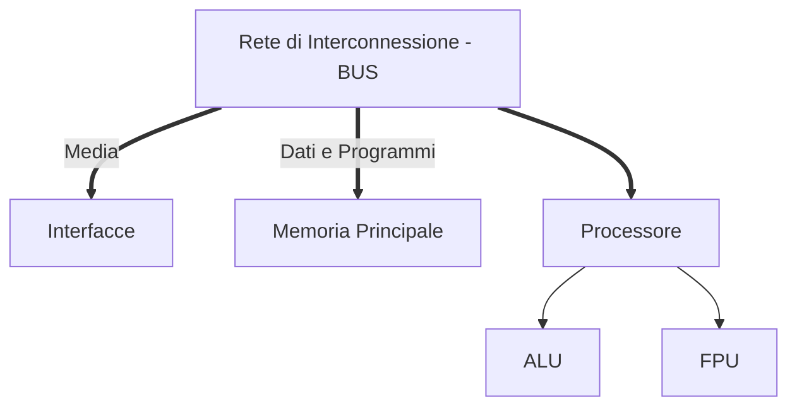

#uni 

# Processore
Il processore contiene i seguenti due blocchi: 
___ALU___
La _Arithmetic Logic Unit_ esegue operazioni logiche (AND, OR, NOT) e lavora con numeri naturali in base 2 oppure con numeri interi in [[Rappresentazione in Complemento a 2]].
___FPU___
_Floating Point Unit_.
Il processore ciclicamente:
1. preleva dal registro __EIP___ la prossima istruzione da eseguire
2. incrementa ___EIP___ del numero di byte dell'istruzione prelevata
3. esegue l'istruzione
Le istruzioni vengono quindi eseguite nell'ordine in cui sono scritte nella memoria centrale, a meno di __salti__, istruzioni che modificano il registro ___EIP___.
### Registri
I registri sono locazioni di memoria interne, a 32bit, e sono ___generali___ o ___di Stato___. Di alcuni registri si possono riferire parti ad 8bit. Ogni registro generale ha una parte a 16bit. Questi sono i registri che ci interessano:

| General          | Status |
| ---------------- | ------ |
| EAX - ah, ax, al | EIP    |
| EBX - bh, bx, bl | EF     |
| ECX - ch, cx, cl |        |
| EDX - dh, dx, dl |        |
| EBP - bp         |        |
| ESI - si         |        |
| EDI - di         |        |
| ESP - sp         |        |
dove $E = 32bit$, $X = 16bit$, $H \ e\ L = 8bit$ ed infine $L \in X$ 
___General___:
___EAX___ = accumulatore = serve per memorizzare operandi di operazioni aritmetiche
___EBX___ = base = indirizzo di base per accesso in memoria
___ECX___ = counter = contatore per cicli (for ecc)
___EDX___ = data = operandi per istruzioni aritmetiche
___EBP___ = base pointer = utilizzato come registro base per accessi in memoria
___ESI___ = source index = registro indice per accessi in memoria
___EDI___ = destination index
___ESP___ = stack pointer = usato per indirizzare la pila/stack, serve per gestire sottoprogrammi ed è una memoria soggetta a disciplina LIFO
___Status___: 
___EIP___ = instruction pointer/program counter =  indirizzo della prossima istruzione, il suo contenuto è fissato al reset iniziale. Questa istruzione deve essere in ROM.
___EF___ = extended flag register = ha 32 elementi detti ___flag___, queste flagservono per indicare lo status del sistema:
	OF = overflow flag = se 1, durante l'esecuzione dell'ultima istruizione si ha avuto un overflow/traboccamento
	SF = sign flag = ultima istruzione ha generato un risultato con $MSB = 1$: se l'istruzione operava su numeri interi, il risultato è un numero negativo.
	ZF = zero flag = ultima istruzione ha generato risultato con tutti $0$ 
	CF = carry flag = ultima istruzione ha generato un ___riporto___/prestito: se ultima istruzione operava sui naturali, il risultato non è rappresentabile.
	Riassunto:
	1. operazione su interi: guardare OF, SF, ZF (CF non significativo)
	2. operazione su naturali: guardare CF, ZF (OF e SF non significativi)
	DF = direction flag, STD set direction flag mette 1 (copia indietro), CDL clear direction flag mette 0 (copia in avanti).
E sta per _extended_, infatti prima i registri erano a 16bit, poi siamo passati a 32bit. 
##### Condizioni al reset
I registri generali non sono rilevanti
1. ___EIP___ vale $0x0000FFF0$ 
	1. vale la prima istruzione che si trova a quell'indirizzo
	2. un po' di celle da quell'indirizzo in poi devono essere implementate in ROM (bootstrap)
2. In ___EF___ i flag che ci interessano valgono 0.

# Spazio di Memoria
Rappresentato da $2^{32}$ celle contigue, dalla capacità di un byte ciascuna, ogni cella è identificata da un numero a 32 bit ([[Informazione]]), detto ___indirizzo___.
In [[Assembly]] gli indirizzi sono simbolici e vengono tradotti in parte dall'assemblatore, in parte a _runtime_, non è quindi cura del programmatore.
Questo spazio di memoria viene implementato nella [[Memoria RAM]], per cui il contenuto è casuale dopo un reset. Solo una parte, la ___ROM___, conserva le informazioni dopo un reset, e possiede le istruzioni per il processore da eseguire dopo appunto un reset.
Il Processore accede, nel senso di leggere/scrivere, a locazioni che possono essere:
1. singola (byte), a 8 bit
2. doppia (word), a 16 bit
3. quadrupla (long/doubleword), a 32 bit
Per l'accesso a locazioni doppie o quadruple, viene utilizzato l'indirizzo più piccolo delle 2 o 4 locazioni, l'indirizzo più grande contiene il bit più significativo.
# Spazio di I/O 
Questo ha $2^{16} = 64k$ ___porte___, ognuna della capacità di un byte e con indirizzo a 16bit.
Raramente una singola porta svolge sia scrittura che lettura.
Il processore accede a lettura o scrittura tramite 2 istruzioni: IN e OUT.
È necessario conoscere gli indirizzi delle interfacce che si vogliono usare per accedervi.