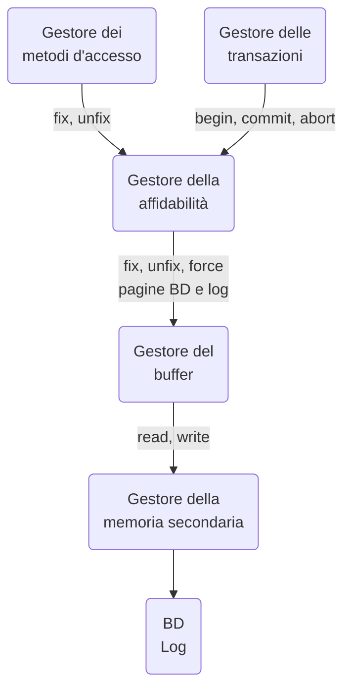

#uni 
Il ___gestore dell'affidabilità___ gestisce l'esecuzione dei ___comandi transazionali___:
1. _start transaction_ (B, begin)
2. _commit work_ (C)
3. _rollback work_ (A, abort)
e le ___operazioni di ripristino___ (recovery) dopo i guasti:
1. ___ripresa a caldo___ (warm restart)
2. ___ripresa a freddo___ (cold restart)
assicura ___atomicità___ e ___durabilità___ e usa il ___log___: un archivio permanente che registra le operazioni svolte.
__Architettura del Gestore di Affidabilità__:

Per capire l'affidabilità è necessario capire la persistenza nelle memoria:
- memoria centrale: non persistente, informazione distrutta da qualsiasi guasto.
- memoria di massa: persistente, sopravvive ai guasti di sistema ma può danneggiarsi l'unità di memorizzazione.
- memoria stabile: questa è una astrazione, è memoria di massa che viene salvaguardata attraverso la ridondanza.
# Log
Questo è un file sequenziale gestito dal gestore di affidabilità scritto in memoria stabile che riporta tutte le operazioni in ordine.
Un record nel Log sono operazioni delle transazioni (begin, update, commit ecc), un record di sistema invece contiene i dump e i checkpoint.
Esempio di Log:
1. begin transaction : $B(T_1)$
2. $w[A]$ con $A=50$ : $I(T_1,A,50)$ 
3. $w[A]$ con $A=20$  : $U(T_1,A,50,20)$ 
4. $r[A]$ con $A=20$ : nessuna modifica
5. commit : $C(T_1)$ 
## Regole di modifica del Log
Regola ___Write-Ahead-Log___:
	- si scrive la parte BS (before state: i valori originali prima della modifica) dei record del log prima di effettuare la corrispondente operazione sul database.
	- consente di disfare le azioni già memorizzate di transazioni senza commit, con UNDO
Regola ___Commit-Precedenza___:
	- si scrive la parte AS (after state) dei record di log prima del commit
	- consente di rifare le azioni di una transazione con commit i cui dati non sono stati scritti in memoria di massa, con REDO
# Backup
Il Log serve a ricostruire le operazione e CK e DUMP servono ad evitare che la ricostruzione parta da zero.
### Checkpoint
Il ___checkpoint___ registra la situazione attuale e le transazioni attive in quell'istante, ha lo scopo duale di confermare che le altre transazioni sono o finite oppure non iniziate, per tutte le transazioni che hanno invece effettuato il commit i dati possono essere trasferiti in memoria di massa.
Questa è la modalità più semplice di checkpoint:
1. si sospende l'accettazione delle operazioni di commit o abort da parte delle transazioni
2. si forza la scrittura in memoria di massa dei dati modificati da transazioni che hanno fato il commit
3. si forza la scrittura nel log di un record contenente gli identificatori delle transazioni attive.
Così facendo garantiamo la persistenza delle transazioni che hanno eseguito il commit.
### Dump
Il Dump esegue una copia completa di riserva del [[Database]], un ____backup___.
Viene solitamente prodotta mentre il sistema non è operativo e viene salvato in memoria stabile.
Un record di Dump nel log indica il momento in cui il dump è stato effettuato.
# Esito di una transazione
L'esito di una transazione è determinato irrevocabilmente quando viene scritto il record di commit nel logo in modo __sincrono__, con una ___force___.
Qualsiasi guasto prima di tale istante porta ad un UNDO di tutte le azioni per ricostruire lo stato del database prima della transazione.
Un guasto successivo invece non deve avere conseguenze: lo stato finale del database deve essere ricostruito, con REDO se necessario.
I __record di abort__ possono essere scritti in modo ___asincrono___.
# UNDO e REDO
UNDO di una azione su un oggetto $O$:
1. `update, delete`: copiare il valore BS nell'oggetto $O$
2. `insert`: eliminare $O$ 
REDO:
1. `isnert, update`: copiare il valore AS nell'oggetto $O$
2. `delete`: eliminare $O$ 
___Idempotenza___ di UNDO e REDO: 
- $undo(undo(A))= undo(A)$ 
- $redo(redo(A))= redo(A)$ 
# Quando scrivere nella Base di Dati
### Modalità Immediata
In questa modalità il [[Database]] contiene i valori AS provenienti da transazioni senza commit, richiede quindi UNDO delle operazioni di transazioni senza commit al momento del guasto, però non richiede REDO.\
### Modalità Differita
In questa modalità il database non contiene valori AS provenienti da transazioni senza commit, in caso di abort non occorre quindi fare nulla (non serve UNDO). Richiede il REDO.
Questa modalità non viene molto utilizzata perché è meno efficiente (anche se favorisce il recovery), poiché si assume che i guasti siano abbastanza rari.
# Modalità Mista
Qui la scrittura può avvenire in entrambe le modalità precedenti, richiede quindi sia il UNDO che REDO.
# Guasti
Guasti Soft: errori software o caduta di tensione
- si perde memoria centrale
- non si perde memoria secondaria (database)
- non si perde memoria stabile (il log)
- si effettua quindi un ___warm restart___ (ripresa a caldo)
Guasti Hard: errori dei dispositivi di memoria secondaria
- si perde memoria centrale e secondaria
- non si perde memoria stabile
- si effettua quindi un ___cold restart___ (ripresa a freddo)
La perdita del Log invece è considerato un evento catastrofico e quindi non è definita alcuna strategia di recupero.
## Modello Fail-Stop
In questo modello l'individuazione di un guasto forza l'arresto completo delle transazioni e il riavvio del sistema operativo, al termine di questa procedura il buffer è vuoto ma le transazioni possono ripartire.
## Processo di Restart
L'obiettivo del restart è classificare le transazioni in:
- completate, quindi con tutti i dati in memoria stabile
- in commit ma non necessariamente completate (possono necessitare di REDO)
- senza commit, quindi vanno annullate con UNDO
Il Gestore dell'Affidabilità, al restart del sistema, legge su un file di RESTART (contenuto nel Log) l'indirizzo dell'ultimo checkpoint e prepara due file: UNDO list con gli identificatori delle transazioni attive, REDO list vuoto. Nessun utente è attivo durante un RESTART
## Ripresa a Caldo
Questa si rende necessaria al presentarsi di un guasto soft ed è divisa in 4 fasi:
1. trovare ultimo checkpoint ripercorrendo il log a ritroso
2. costruire le liste UNDO (transazioni attive ma non committed prima del guasto) e REDO
3. ripercorrere il Log al contrario (___rollback___) fino alla più vecchia azione delle transazioni nella lista UNDO e REDO, ripristinando tutte le azioni delle transazioni in UNDO
4. ripercorrere il Log in avanti (___rollforward___) rifacendo tutte le azioni delle transazioni in REDO
## Ripresa a Freddo
Necessaria quando si presenta un guasto hard:
1. cerchiamo il record di dump più recente nel Log e si ripristina la parte di dati deteriorata
2. si seguono le operazioni registrate nel log fino all'istante del guasto
3. si esegue una ripresa a caldo.