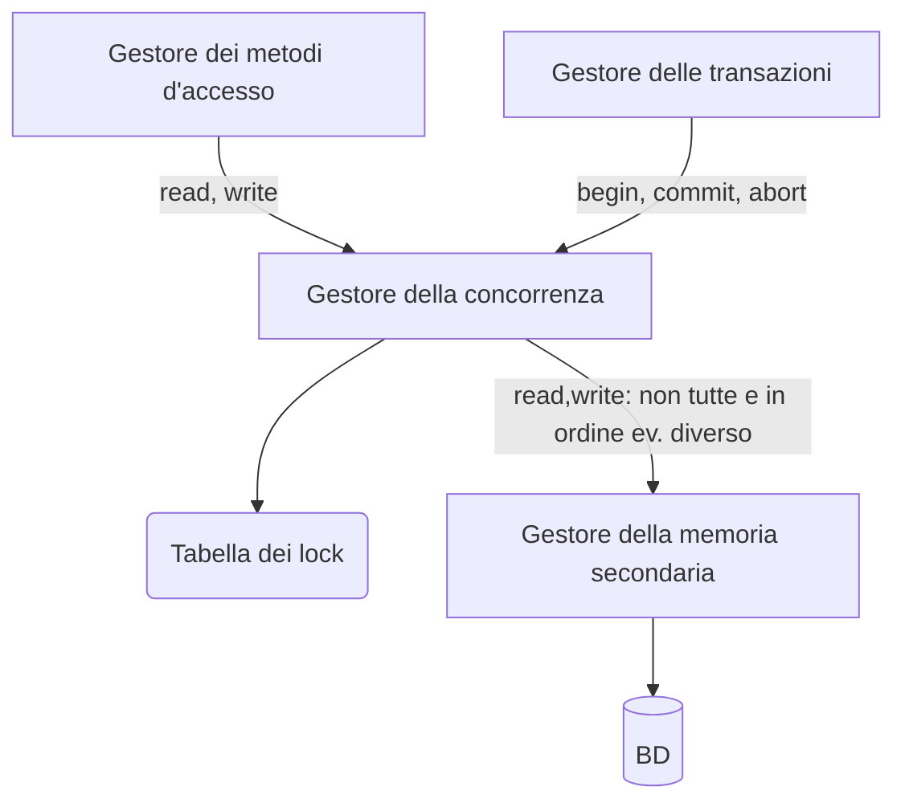

#uni 
La concorrenza è fondamentale, decine o centinaia di transazioni al secondo non possono essere seriali. Si appoggia sulla [[Gestione delle Transazioni]].
Senza una gestione accurata la concorrenza causerebbe però anomalie: per esempio se due transazioni operano sullo stesso valore possono leggere un valore intermedio "sporco".
Ci sono diversi tipi di anomalie:
- perdita di aggiornamento: W-W
- Lettura sporca: R-W o W-W con aborto
- Lettura inconsistente: R-W
- Aggiornamento Fantasma: R-W
- Inserimento fantasma: R-W su dato "nuovo"
# Schedule
Uno schedule $S$ è una sequenza di operazioni di lettura/ scrittura di transazioni concorrenti.
Esempio: $S:r_1(x) \ \ r_2(z) \ \ w_1(x) \ \ w_2(z)$ dove $r_2(x)$ rappresenta la lettura dell'oggetto $x$ da parte della transazione $T_1$.
Le operazioni compaiono nello schedule nell'ordine temporale di esecuzione sul database.
### Schedule seriale
Uno schedule di transazioni $T=\{T_1,...,T_n\}$ è detto seriale se per ogni coppia di transazioni tutte le operazioni di una delle due sono eseguite prima di qualsiasi operazione dell'altra.
Esempio: $T=\{T_0,T_1\} \to S = r_0(x) \ \ r_0(y) \ \ r_1(x) \ \ w_1(y)$  
##### Schedule Serializzabile
# Controllo di Concorrenza
Il controllo della concorrenza è eseguito dallo ___scheduler___, che traccia tutte le operazioni eseguite sul database dalle transazioni e decide se accettare o rifiutare le operazioni che vengono richieste, il suo obiettivo è evitare le __anomalie__.
Per il momento assumiamo che l'esito delle transazioni sia noto a priori (ipotesi ___commit-proiezione___), così facendo possiamo rimuovere dallo schedule tutte le transazioni abortite, questa assunzione però non ci consente di trattare anomalie come la lettura sporca.
# Media

